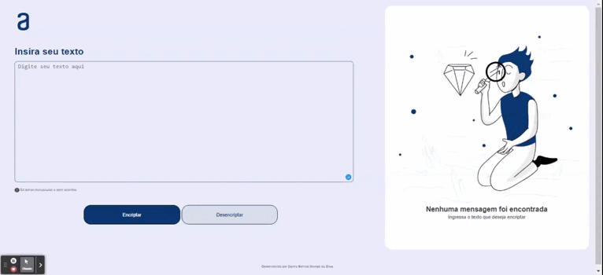

# Decodificador e codificador

Esse projeto foi desenvolvido para encripta e desencriptar o texto escrito dentro do textarea. 

      

 
  
  
 <h2> Esse projeto foi desenvolvido usando as tecnologias </h2>
 
 * HTML
 * CSS
 *  JavaScript
